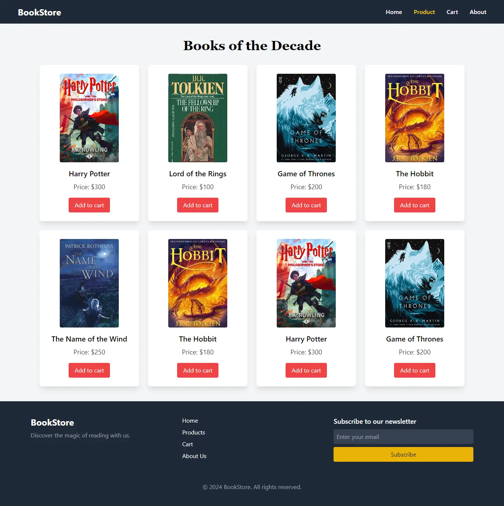
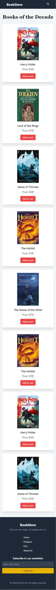

# BookStore - Nuxt.js Project
## Overview

- This is a simple BookStore application built using Nuxt.js. The application displays a collection of fantasy books like Harry Potter, Lord of the Rings, and Game of Thrones. Users can browse the books, view details, and manage their shopping cart. The project uses Pinia for state management, making it easy to manage the cart and other global states.

## Features
- Display a list of fantasy books.
- Dynamic data rendering.
- View detailed information for each book on a single product page.
- Add books to a cart and manage quantities.
- Responsive design for both desktop and mobile views.
- State management using Pinia for the shopping cart functionality.

## Upcoming Features 
- Weather widget.
- Dynamic server routes: For securing personal data (e.g API Keys).
- Error pages : Different error page for different error code (e.g 404,500).


## Technologies Used
- Nuxt.js: Framework for building Vue.js applications.
- Vue 3: Frontend framework used to build the UI components.
- Pinia: A simple and lightweight state management library for Vue.
- Tailwind CSS: Utility-first CSS framework used for responsive design.
- Lucide Vue: Icon library for Vue.js.
- V-motion: For scroll-triggered animations.

This project provides a great example of how to combine these technologies to build a dynamic, user-friendly online bookstore

## ScreenShots
- **Desktop view Gif**


<br>

- **Desktop view Product Page**


<br>

- **Mobile view Product page**


## Installation
- Prerequisites
 Make sure you have the following installed on your machine:

- Node.js (v14 or higher)
- npm or yarn
- Clone this repository:

```
git clone https://github.com/your-username/bookstore-nuxt.git
```
- Navigate to the project directory:
```
cd bookstore
```
- Install dependencies:
```
npm install
```
- Run the development server:
```
npm run dev
```

## Folder Structure
```
D:.
|   .gitignore
|   app.vue
|   error.vue
|   nuxt.config.ts
|   output.txt
|   package-lock.json
|   package.json
|   README.md
|   tailwind.config.js
|   tsconfig.json
|   
+---assets
|   \---css
|           main.css
|           
+---components
|    \---ui
|           FooterComp.vue
|           NavBar.vue
|           
+---layouts
|       default.vue
|       
+---pages
|   |   About.vue
|   |   Cart.vue
|   |   index.vue
|   |   
|   \---product
|           index.vue
|           [id].vue
|           
+---public
|       favicon.ico
|       robots.txt
|       
+---server
|       tsconfig.json
|       
\---store
        Books.js
        cart.js
```